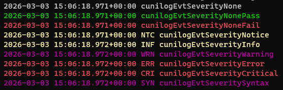

# Cunilog event severities

Log severity levels are usually understood as events being tagged according to their priorities. In Cunilog, event severities are not on different levels by default.

On the console/in a terminal, the actual distinction between different severities is mostly visual. Events of different severities are printed in different colours by utilising ANSI escape codes, unless disabled.




```
2026-03-03 15:06:18.971+00:00 cunilogEvtSeverityNone
2026-03-03 15:06:18.971+00:00 cunilogEvtSeverityNonePass
2026-03-03 15:06:18.971+00:00 cunilogEvtSeverityNoneFail
2026-03-03 15:06:18.971+00:00 NTC cunilogEvtSeverityNotice
2026-03-03 15:06:18.972+00:00 INF cunilogEvtSeverityInfo
2026-03-03 15:06:18.972+00:00 WRN cunilogEvtSeverityWarning
2026-03-03 15:06:18.972+00:00 ERR cunilogEvtSeverityError
2026-03-03 15:06:18.972+00:00 CRI cunilogEvtSeverityCritical
2026-03-03 15:06:18.972+00:00 SYN cunilogEvtSeveritySyntax
```
Severities are an enumeration of values that can be enabled by setting their respective bit within a target's severity mask (member __severityLvlMask__ of the target structure __CUNILOG_TARGET__). If its bit is set (value 1), the event is processed. If the bit in question is cleared (value 0), an event with this severity is suppressed/rejected. Logging functions silently pass (return true) but do not generate an event with a disabled event severity.

There's no numeric relationship between severities. They all have their own bit assigned in the severity mask of the target. No other relationship should be assumed. For instance, do not assume that severity cunilogEvtSeverityFatal has a lower or higher value or priority than cunilogEvtSeverityWarning. This may or may not be the case right now or in some version of Cunilog. Severities are obviously ordered in some way within their enum but this is not guarranteed to stay the same from version to version.

When a target is created or initialised, all severities apart from cunilogEvtSeverityDebug are enabled by default. The idea behind this is that debug messages must be enabled explicitely.

To enable a severity for a CUNILOG_TARGET, use __ConfigCUNILOG_TARGETenableEventSeverity ()__. To disable it, call __ConfigCUNILOG_TARGETdisableEventSeverity ()__.

With __ConfigCUNILOG_TARGETdisableEventSeverities ()__ and __ConfigCUNILOG_TARGETenableEventSeverities ()__ an array of event severities can be disabled or enabled.

To enable all severities for a target, call __ConfigCUNILOG_TARGETeventSeverityMask ()__ with the parameter newsevmask set to __MAX_EVTSEVMASK__. If newsevmask is 0, all severities are disabled. __MAX_EVTSEVMASK__ sets all severity mask bits to 1 while 0 clears them out.


# Severity prefixes

The severity of an event is a text tag at the start of a logging event. This event tag (also: severity prefix) is in a particular format ("severity format") . Here's a few examples for event severity __cunilogEvtSeverityWarning__ in different severity formats:
```
"WRN"
"[WRN]"
"WARN "
"WARN"
"WARNING  "
"[WARNING]  "
"[WARNING  ]"
```
While the texts (the actual severity prefixes) are fixed, the possible prefix formats are listed in the enum __cunilogeventseverityformat__, which has a typedef of __cueventseverityformat__.

Use the function __ConfigCUNILOG_TARGETeventSeverityFormat ()__ to change the severity prefix format of a target for which no logging function has been called yet (i.e. directly after the target has been created and/or initialised), or call __ChangeCUNILOG_TARGETeventSeverityFormat ()__ to change it later on. The latter function guarrantees that no race condition occurs for multi-threaded targets by queuing an event that changes the format of the severity text tag safely on-the-fly.
